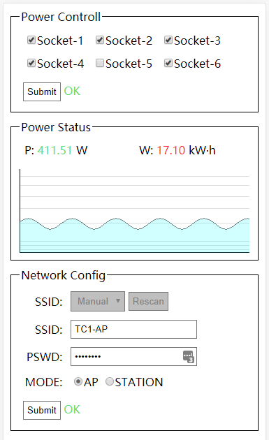

# 斐讯TC1 a1智能排插第三方固件
排插TC1因为服务器关闭,无法使用. 故而为其开发一个不需要服务器也能满足基本智能控制使用的固件.

# 固件web界面

固件启动后, 会开启一个热点, 接热点后, 直接用浏览器访问: http://192.168.0.1 即可看到如web界面.

# 注意

TC1排插硬件分a1 a2两个版本,本固件仅支持**a1版本**. a1 a2两个版本仅主控不同, 除此之外其他无任何区别.

# 区分硬件版本

硬件版本在外包装底部,如图所示:

如果没有包装, 只能拆开分辨, 如图, 左侧为不支持的a2版本 右侧为支持的a1版本.

# 已知BUG

不定时重启断电!!! 

定时任务偶尔无效

# 特性

本固件使用斐讯TC1排插硬件为基础,实现以下功能:

- [x] 按键控制所有插口通断
- [x] 控制每个接口独立开关
- [ ] 每个接口拥有独立的5组定时开关
- [ ] ota在线升级
- [ ] MQTT服务器连接控制
- [x] 通过mqtt连入homeassistant
- [x] Web实时显示功率

# 开始

整体流程如下:拆开TC1,将固件/烧录器/pc互相连接,在pc运行烧录软件进行烧录,烧录固件.

烧录完成后,首次使用前配对网络并配置mqtt服务器,之后就可以使用了.

# 拆机接线及烧录固件相关

见[固件烧录](https://github.com/a2633063/zTC1/wiki/固件烧录)

烧录固件完成后,即可开始使用

# 开始使用/使用方法

见[开始使用](https://github.com/a2633063/zTC1/wiki/开始使用)

# 接入home assistant

见[homeassistant接入](https://github.com/a2633063/zTC1/wiki/homeassistant接入)

# 其他内容

## 代码编译

> 此项为专业开发人员准备,如果你不是开发人员,请跳过此项

TC1使用的主控为EMW3031,基于MiCO(MCU based Internet Connectivity Operating System)开发.[MiCO简介点这里](http://developer.mxchip.com/handbooks/101)

需要按照官方说明才能保证此项目能够编译成功:

1. 安装[MiCO Cube编译工具](http://developer.mxchip.com/handbooks/102)
2. 配置[MICoder IDE环境](http://developer.mxchip.com/handbooks/105)
3. 配置[Jlink下载工具](http://developer.mxchip.com/handbooks/103)
4. check out 此项目,按照[从一个现有的 Git 仓库克隆导入](http://developer.mxchip.com/handbooks/102#%E4%BB%8E%E4%B8%80%E4%B8%AA%E7%8E%B0%E6%9C%89%E7%9A%84-git-%E4%BB%93%E5%BA%93%E5%85%8B%E9%9A%86%E5%AF%BC%E5%85%A5)确认项目编译/下载正常

## 通信协议

> 此项为专业开发人员准备,如果你不是开发人员,请跳过此项

所有通信协议开源,你可以自己开发控制app或ios端

见[通信协议](https://github.com/a2633063/zTC1/wiki/通信协议)

# 联系

如有其它问题, 可以联系本人 Telegram: [@zogodo](https://t.me/zogodo)

或者发送邮件给我: zhogodo@gmail.com

